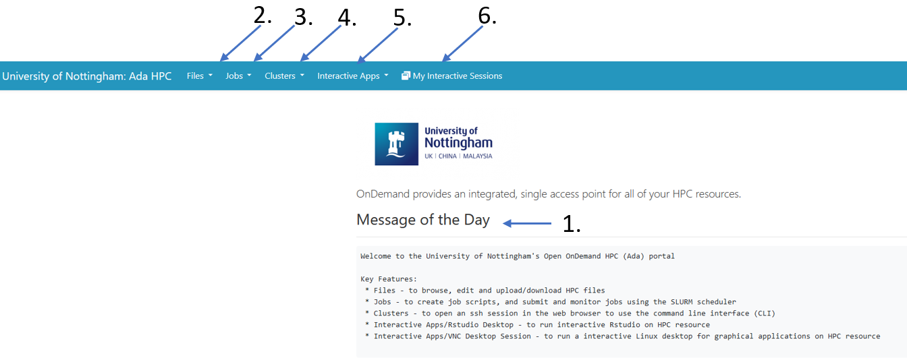
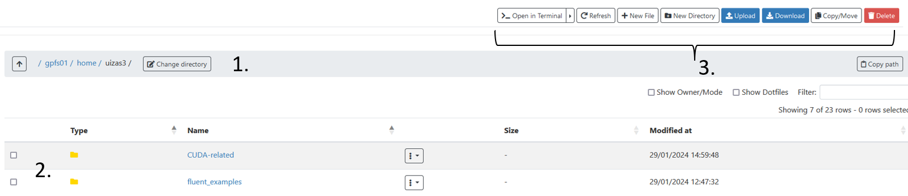
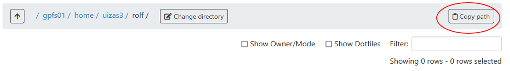
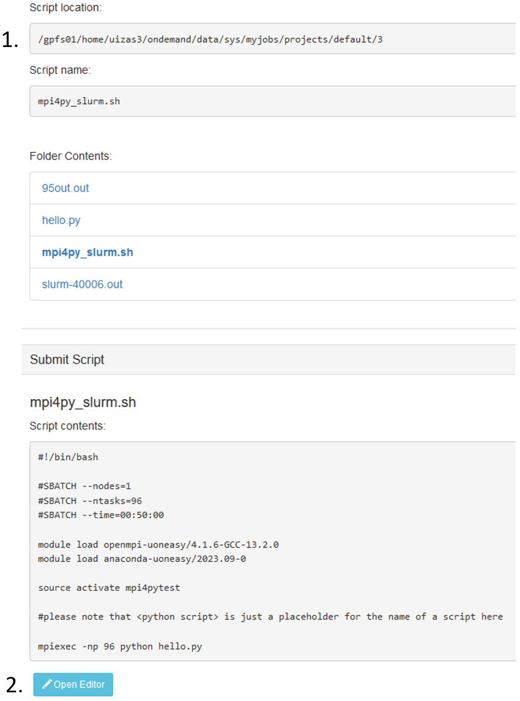
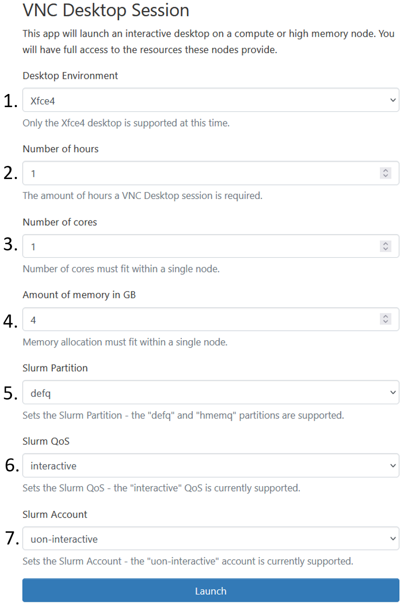

.. Open_On_Demand documentation for ADA documentation master file, created by
   sphinx-quickstart on Thu Feb 15 15:58:45 2024.
   You can adapt this file completely to your liking, but it should at least
   contain the root `toctree` directive.

Welcome to documentaion of Open On Demand for ADA!
==================================================

This documentation walks you through the basic concepts of Open_On_Demand and how to use it on ADA. 
This documentaion requires only none to some linux experience and is well suited to first time users who want to utilize the HPC system without any linux experience.

.. contents:: :local:

What is Open on demand?
---------------------------

The **OpenOnDemand** is a GUI based tool that allows users to access the HPC system and submit and track jobs using the GUI based wizard. 

The image indicates the opening page of **OpenOnDemand** page. This includes, 

1. Message of the day: All the relevant information about the various tabs within itself. 
2. Files: Leads the user to the home directory of ADA's login.
3. Jobs: This helps users create a job script using the GUI, with which the jobs can be submitted and tracked. 
4. Clusters: Will provide a direct ssh to the home page of the user on Ada, and open a command line interface, which is the traditional way of using an HPC system. 
5. Interactive Apps: These are custom made templates for specific softwares, which provides a means to use the system, just like your own personal machine, but for that particular software only. 
6. Runs an interactive Linux desktop for graphical applications on HPC resource.

Lets take a look at each of them one by one. Should you want to start submitting job right-away, then go to <add link here. >

Files
=====

Clicking on ``files`` > ``Home Directory``, will take you to the home (my computer equivalent of linux) directory. The page looks as follows, with 3 main sections. 

#. The home directory path. 
#. The files that exists within this path. (You can upload files from your desktop using the upload button.)
#. Various commands that can be performed on your home directory. 

   #. **_Open in Terminal** Opens a shell of the home directory.
   #. **Refresh** Will refresh the current directory, to save any changes made to the directory. 
   #. **+New file** Will create a new file that will be created within the home directory. 
   #. **New directory** Will create a new folder in the home directory. 
   #. **Upload** Uploads a file from your system to the ``gpfs01/home/user_id`` directory as seen from 1.
   #. **Copy/Move** Will help you move the files from a source to destination. See the following example. 
      
      .. image:: copy_files.png
      
      #. Select the file or directory that you want to copy or move. 
      #. Go to the directory that you want to copy the file selected above. In this case ``gpfs01/home/uizas3/rolf/``. 
      #. Click copy. 

   #. **Delete** This will delete the selected files/folders.
 
Jobs
====

This section will help with creating, submitting and tracking the jobs within **OpenOnDemand**. 

There are majorly two tabs in this section. Namely **Active jobs** and **Job Composer**. Lets look at the later, first. 

The **Job composer** opens up a new tab that gives a tour of what can be done within this interface. Primarily, this is used to construct the necessary scripts for submitting jobs. 

Ideally, the user needs to put all the neccessary data required to run the job in one directory and then open the **Job composer** so the system knows which directory is the job submitted from. Hence it is recommended to copy files to a single directory before composing a job. 

Three options are availble in this new tab. Namely, 

#. From Default template.  
#. From Specified path.  
#. From selected job.  

**From Default template** will provide you to create your own templates for jobs that are submitted often. This way only few changes will be required before you can submit jobs. One default template is already provided for brief explaination. Feel free to edit this according to your requirement. 

**From Specified path**, provides you to submit job from a particular directory. This is seen from the page that opens after clicking this. The first required field in this is source path. This is the path of the directory where the code or your job files are kept. This can be obtained by clicking ``Files`` >> ``home directory`` >> ``myfolder``, and then clicking the ``Copy path`` command available in the top right corner of the same page. 

This can now be pasted in the ``source path`` tab of the **From Specified jobs** page. 

You can now fill in the other optional details on the page. Or save and come back into this page, to edit the various scripts.

In the **Job Details** tab, now seen on the right of the page. If the script name field is empty, this is an indication that a slurm script needs to be specified here. (SLURM is a scheduler that will queue the jobs to the HPC system, this script will identify the hardware required for your jobs with the ``#SBATCH`` directives. Look `here <https://uniofnottm.sharepoint.com/sites/DigitalResearch/SitePages/Allocating-resources-for-an-HPC-job.aspx>`_ to understand how to write this script.). 

Note that, the script that will submit the job is previewed in the section called as ``Submit script`` observed at the bottom of the ``Job Details`` page. This script can be edited by clicking the ``Open editor`` **(2)** button at the end. 
Also note that, any changes made to the script here, will be stored in the path mentioned at ``Script location``, which means that the original file in the ``source path`` **(1)** will remain unchanged. Make the changes accordingly.

Finally **From Selected Job** uses a job selected and creates a copy of the same job to be submitted again. 

Clusters
========

This opens up a shell (traditional way of using linux based HPC systems). More proficient users are welcome to interact with the system in this manner for writing and submitting jobs. 
Feel free to look up linux basics from `this page <https://linuxbasics-doc-uon.readthedocs.io/en/latest/>`_ .

Interactive Apps
================

The interactive apps are intended to run various softwares just as you would run on your local machines, but will have the hardware resources of the cluster. Currently two services are available. 
**VNC Desktop session** and **RStudio Desktop**. More of these will be updated soon, and will become available in this dropdown. 

For **VNC Desktop session** looks as follows and the resources booked in this tab, will book the same for you. 

#. Desktop environment: Usually stays default, i.e. Xfce4 unless specified otherwise. 
#. Number of hours: This will book the resource for that long. 
#. Number of cores: This will be the cores within 1 node of the partition requested. Look at this `page <https://uniofnottm.sharepoint.com/sites/DigitalResearch/SitePages/Ada-Commands-Partitions-and-Resources.aspx?xsdata=MDV8MDJ8fDVmM2M5NTg2YjcxNjRlMjUxMjAxMDhkYzMxNDY2M2IzfDY3YmRhN2VlZmQ4MDQxZWZhYzkxMzU4NDE4MjkwYTFlfDB8MHw2Mzg0Mzk0MjU1Njk5MTk0ODl8VW5rbm93bnxWR1ZoYlhOVFpXTjFjbWwwZVZObGNuWnBZMlY4ZXlKV0lqb2lNQzR3TGpBd01EQWlMQ0pRSWpvaVYybHVNeklpTENKQlRpSTZJazkwYUdWeUlpd2lWMVFpT2pFeGZRPT18MXxMM1JsWVcxekx6RTVPakEyTkdSaFl6VXlZVGxoTmpRME5qZGlabUZpTWpReVpHTmtOVFV3TVdZNFFIUm9jbVZoWkM1MFlXTjJNaTlqYUdGdWJtVnNjeTh4T1Rwa056Um1PREEzTW1abFpEYzBNRFpqWVRCak1XSmhOV0l3TlRabE9XWTJZVUIwYUhKbFlXUXVkR0ZqZGpJdmJXVnpjMkZuWlhNdk1UY3dPRE0wTlRjMU5qQXdNZz09fGFjMzE1MDg2MWYzODQ0MjBhZmFmMDhkYzMxNDY2M2IwfGNlMTI4ZWMxYTFiNjQxN2Y4OGRjYTI3ZThhYmNjNjY1&sdata=VVJKd0tWd213ZW40RjhFdGlad3VjbnNQQS82TWl3ejNqeGRsTldRZUM5ND0%3D>`_ to know the upper limit of each node in every partition. 
#. Amount in memory (GB): Is the requested memory. Again to know the upper limit of a node of a partition, refer to the link mentioned in 3. 
#. Slurm partition: Is the various partitions to which the jobs can be submitted. Special users have higher priority on some partitions, while some partitions are general ones. Choose accordingly, default partition is **defq**. 
#. Slurm QoS: This is again set as default. 
#. Slurm Account: Kept as default.

For **Rstudio Desktop** similar options as above will be shown. However, in this case, the application that will open is Rstudio. This way the user can use Rstudio, just like they would use in their local machine, but the hardware resources will be that of the HPC system. 

On **Launch**, it is possible that the requested resource may not be available immediately. This will be indicated with the status ``"pending"``. Once the requested hardware becomes available, one can click **Launch VNC Desktop session** to open either
A successfully opened session, will provide access to the requested resource in a linux-OS based GUI interface. 

Exiting out of the session, with logging off, and then deleting the session from the ``my intereactive session`` is a good practice to keep. Note that the email notification of both, when the resource becomes avaailble and when the resource has been logged out of, will be sent on the user's email id. 

..
   Say for example you want to run a **python** file. The necessary things to run this job succesfully is that you should have your conda enviornment built up. (If you are not sure how to build a conda enviornment, have a look at conda's original documentation `here. <https://conda.io/projects/conda/en/latest/user-guide/tasks/manage-environments.html#creating-an-environment-with-commands>`_)

.. toctree::
   :maxdepth: 3
   :caption: Contents:

..
   Indices and tables
   ==================

   * :ref:`genindex`
   * :ref:`modindex`
   * :ref:`search`
